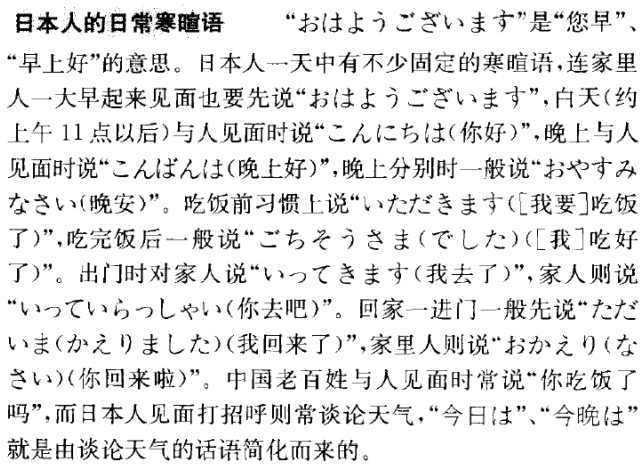
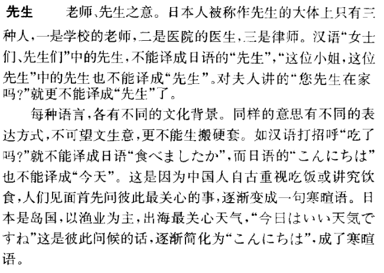

第四课 私たちの教室は部屋が広いです
============================================================

生词表
----------

.. csv-table:: 生词表
   :header: 单词,词类,释义

   わたしたち[私たち],名,我们
   けんきゅうしつ[研究室],名,研究室
   ひろい[広い],形,宽敞
   せまい[狭い],形,狭小
   そして,接,而且
   まど[窓],名,窗户
   けれども,接,但是，可是
   クラス,名,班级
   おとこ[男],名,男子
   がくしゅういいん[学習委員],名,学习委员
   かれ[彼],代,他
   せ[背],名,个子，身长
   あたま[頭],名,头
   ぶんげいいいん[文芸委員],名,文艺委员
   うた[歌],名,歌曲
   じょうず[上手],形动,擅长，高明的，技术好的
   とても,副,非常，很
   かっぱつ[活発],形动,活跃
   もちろん,副,当然
   ほう[方],名,（并列或比较时的）部分、类型
   くらい[暗い],形,黑暗
   やばり,副,仍然，还是
   かた[方],名,（表示对人的敬称）
   やさしい[優しい],形,温柔和善
   あわせて[合わせて],连语,共计，合计
   だんせい[男性],名,男性
   じょせい[女性],名,女性
   ちょっと,名,暂且，稍微，一会儿
   きょう[今日],名,今天
   てんき[天気],名,天气
   かぜ[風],名,风
   あたたかい[暖かい],形,暖和
   どちら,名,哪边，哪个
   とおい[遠い],形,远
   すぐ,名,马上，立刻
   いく[行く],自五,去
   しつれい[失礼],名-自サ,告辞，再见，失敬

句型
-------------------
一、 ::

   （体言）は（体言）が（形容词基本形，形容动词词干）です。

- 私たちの教室は部屋が広いです。
- 彼の背が高いです。
- 我が国は水産が丰富です。
- 北京の街が綺麗です。

二、 ::

   （体言）は（形容词基本形）て／（形容动词词干）で、……です。/ ……而又……

- この教室は広く明るいです。
- この下は安くて丈夫です。
- ここは静かで明るいところです。

三、 ::

   （体言）は（体言）で，（体言）は（体言）です。/ ……是……，……是……。

- これは私の本で、それはりさんの本です。
- この建物は学校で、あの建物は銀行です。

四、 ::

   （体言）と（体言）とどちらが（形容词/形容动词）か
   （体言）より（体言）のほうが（形容词/形容动词）
   どちらも…

- きょうじつと研究室とどちらが広いですか？
   - 休日の方は広いです。
   - どちらも広いです。
- 教室と図書館とどちらが静かですか？
   - 図書館の方が静かです。
   - どちらも静かです。

五、 ::

   それほど…ない/ 并不那么……

- 研究室はそれほど暗くはありません。
- 外はそれほど寒くありません。

六、 ::

   （体言）は（体言）ほど（形容词连用形く）ないです。
   （体言）は（体言）ほど（形容词连用形では）ないです。

- 自動車は汽車ほど速くないです。
- 去年は昨年ほど寒くはありません。
- 女性は男性ほど多くないです。
- この机はその机ほど綺麗ではありません。
- この靴はそのほど丈夫ではありません。

语法
--------------

一、总主语句
^^^^^^^^^^^^^^^^^^^^^^^^

描写句中，由主谓结构构成谓语部分来说明人或事物的性质、状态的句子叫总主语句。这种句子的主语（总主语）用提示助词「は」表示，谓语句中小主语用「が」表示。

二、接续词「そして」「けれども」
^^^^^^^^^^^^^^^^^^^^^^^^^^^^^^^^^^^^^^^^^^^^^^^^
1. 「そして」表示语义上的附加，相当于汉语“而且，又”

   - 私たちの教室は部屋が広いです。そしてが大きいです。
   - 彼は背が高いです。そして力も強いです。

2. 「けれども」表示转折，相当于汉语“但是，不过”

   - 研究室の部屋がちょっと狭いです。けれども、静かで明るいところです。
   - それは大きいです。けれども、これは小さいです。

三、 指示代词
^^^^^^^^^^^^^^^^^^^^^^^^

- 近称：これ、ここ、こちら,こっち
- 中称：それ、そこ、そちら,そっち
- 远称：あれ、あそこ、あちら,あっち
- 不定称：どれ、どこ、どちら,どっち

四、 接续助词「が」
^^^^^^^^^^^^^^^^^^^^^^^^

接续助词在接在用言、助动词终止形后边，连接两个句子。它的职能与接续词一样。接续助词「が」表示转折，相当于汉语的“可是，但是”。

- この万年筆は安いですが，あまり良くありません。
- 私の部屋は狭いですが，明るいです。

五、 格助词「が」
^^^^^^^^^^^^^^^^^^^^^^^^

表示好恶，巧拙的对象

- 私はスポーツが好きです。
- 私は数学が嫌いです。
- 兄はピンポンが上手です。
- 弟はピンポンが下手です。

六、 格助词「より」
^^^^^^^^^^^^^^^^^^^^^^^^

接在体言后面，相当于汉语的“……比……”

- 日本語は英語より難しいです。
- 研究室より教室は方が広いです。

七、 副助词「ほど」
^^^^^^^^^^^^^^^^^^^^^^^^

接在体言的后面，后续谓语为否定式，（举例比较）表示事物没有达到那种程度。

- この部屋はあの部屋ほど明るくありません。
- この鉛筆はその鉛筆ほど長くないです。

八、 格助词「で」
^^^^^^^^^^^^^^^^^^^^^^^^
接在体言后面，表示限定范围。后续词多为形容词、形容动词。相当于汉语的“在”

- クラスで女性が多いです。
- 王さんはクラスで背が一番高いです。

课后练习
-------------

.. toctree::
   :maxdepth: 1

   chap12-q
   chap12-qa

补充生词
----------

.. csv-table:: 生词表
   :header: 单词,词类,释义

   くろい[黒い],形,黑色的
   かさ[傘],名,伞
   カメラ,名,照相机
   まるい[丸い],形,圆的
   しかくい[四角い],形,方的
   はし[橋],名,桥
   とうきょう[東京],名,东京
   きょうと[京都],名,京都
   なんきん[南京],名,南京
   はる[春],名,春
   なつ[夏],名,夏
   あき[秋],名,秋
   ふゆ[冬],名,冬
   げつようび[月曜日],名,星期一
   すいようび[水曜日],名,星期三
   いそがしい[忙しい],形,忙碌
   じんこう[人口],名, 
   タクシー,名,taxi，出租车
   バス,名,bus
   にほんせい[日本製],名, 
   ちゅうごくせい[中国製],名, 
   ぞう[象],名, 
   はな[鼻],名, 
   ほっかいどう[北海道],名, 
   れきし[歴史],名, 
   からだ[体],名,身体
   じょうぶ[丈夫],形动,（身体）健康强壮
   ばら[薔薇],名, 
   におい[匂い],名,香味，芳香，味道
   きおん[気温],名, 
   きたない[汚い],形,肮脏
   こうつう[交通],名, 
   にもつ[荷物],名,行李
   ケーキ,名,蛋糕
   しょくどう[食堂],名, 
   こうどう[講堂],名, 
   ちきゅう[地球],名, 
   つき[月],名,月亮
   ひこうき[飛行機],名,飞机
   ラジオ,名,radio，收音机
   ねだん[値段],名,价格
   いちご[苺],名,草莓
   レモン,名,lemon
   ビタミン,名,维生素
   シャンハイ,名,上海
   ワープロ,名,文字处理机
   タイプライター,名,打字机
   ようすこう[揚子江],名,长江
   スーパーマーケット,名,超市
   せいせき[成績],名,
   なかむら[中村],名,（姓氏）中村
   きせつ[季節],名,
   みみ[耳],名,
   め[目],名,

语言文化之窗
--------------------------

日本人的寒暄语
^^^^^^^^^^^^^^^^^^^^^^^^^^^^^^^^^^^^^^^^^^^^^^

先生
^^^^^^^^^^^^^^^^^^^^^^^^^^^^^^^^^^^^^^^^^^^^^^

