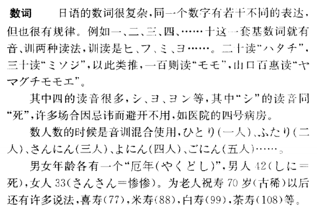
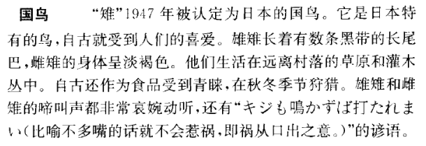
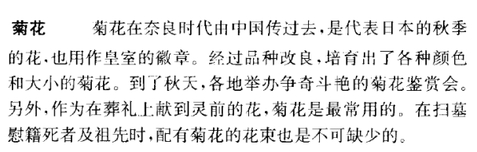

第五课 教室にはドアが二つあります
============================================================

生词表
----------

.. csv-table:: 生词表
   :header: 单词,词类,释义

   ドア,名,door
   たくさん,副-形动,多，很多
   いる,自上一,（人/动物）有，在
   いろいろ[色々],形动,各式各样，形形色色
   もの[物],名,东西
   いくつ,代,几个，多个
   にん[人],接尾,……人，……名
   さつ[冊],接尾,……本，……册
   すみ[隅],名,角落
   など,副助,（表示列举）等
   まい[枚],接尾,（平薄的物品）张、片、幅
   キャンパス,名,campus，大学校园
   さんぽ[散歩],名-自サ,散步
   かだん[花壇],名,
   ことり[小鳥],名,
   わ[羽],接尾,（数鸟、兔子等）只
   しゅるい[種類],名,
   こい[鯉],名,
   ひき[匹],接尾,（数鱼虫类的）只
   かわいい[可愛い],形,可爱的
   

句型
---------------

一、 ::

   （体言）には（体言）がいます。/ 在……（地方）有……（人或动物）

- 教室には学校がいます。
- そこに魚がいます。

二、 ::

   （数词）しか（ありません・いません）。/ 只有

- この教室には本棚は二つしかありません。
- このクラスには北京の人は1人しかいません。

三、 ::
   
   （体言）や[（体言）や]（体言）など / ……和……等

- 机の上に本や雑誌やノートなどがあります。
- 駅の前には銀行や映画館などがあります。

语法
-------------------------

一、存在句
^^^^^^^^^^^^^^^^^^^^^^^^^^^^^^^^

叙述人或动物是否存在的句子也叫作存在句，谓语是「いる」。

二、 数词
^^^^^^^^^^^^^^^^^^^^^^^^^^^^^^^^

表示事物的数量和顺序的词为数词。数词可以分为基数词，量数词和序数词。

1. 基数词

   一至五：いち、に、さん、し・よん、ご

   六至十：ろく、しち・なな、はち、く、じゅう

   百、千、万、亿：ひゃく、せん、まん、おく

2. 量数词

   1. 个数：

      一至五：ひとつ、ふたつ、みっつ、よっつ、いつつ。

      六至十：むっつ、ななつ、やっつ、ここのつ、とお

      几个：いくつ

   2. 人数

      一至五：ひとり、ふたり、さんにん、よにん、ごにん、
      
      六至十：ろくにん、しちにん、はちにん、くにん・きゅうにん、じゅうにん

      几人：なんにん

   3. 书/杂志/笔记等东西：基数词+さつ（冊）
   4. 细而长的东西：基数词+ほん（本）
   5. 宽而薄的东西：基数词+まい（枚）
   6. 禽类：基数词+わ（羽）
   7. 兽虫鱼：基数词+ひき（匹）

3. 序数词

   计算事物的顺序的数词，一般在基数词之前加“第”，或在基数词后加“番”或“番目”，或在量数词后加“目”

三、格助词「で」
^^^^^^^^^^^^^^^^^^^^^^^^^^^^^^^^^^^^^^^^^^^^^^^^^^^^^^^^^^^

接在「みんな」「全部」之后构成补语。表示数量、价钱总共的意思。

- 全部で20あります。
- 鉛筆は5本で5000円です。

四、并列助词「や」
^^^^^^^^^^^^^^^^^^^^^^^^^^^^^^^^^^^^^^^^^^^^^^^^^^^^^^^^^^^

接在体言与体言之间，表示列举两个以上的事物。相比于「と」，助词「や」不仅带有句中列举的事物，还包括类似的事物，带有“之类的”的语气。

课后练习
-------------

.. toctree::
   :maxdepth: 1

   chap13-q
   chap13-qa

补充生词
----------

.. csv-table:: 生词表
   :header: 单词,词类,释义

   けしゴム[消しゴム],名,橡皮
   テーブル,名,桌子，台子
   ねこ[猫],名,
   にわ[庭],名,院子
   いぬ[犬],名,
   すいそう[水槽],名,
   きんぎょ[金魚],名,
   ワイシャツ,名,衬衫
   おんなのこ[女の子],名,
   ハンドバッグ,名,手提包
   ハンカチ,名,手帕
   かご[籠],名,筐
   やね[屋根],名,屋顶
   はと[鳩],名,鸽子
   にわとり[鶏],名,鸡
   ねずみ[鼠],名,
   ビール,名,beer
   がいらいご[外来語],名,
   みかん[蜜柑],名,
   シャツ,名,衬衫
   あおい[青い],名,蓝色
   ウイスキー,名,威士忌
   ペン,名,pen
   かえる[蛙],名,
   くずいれ[屑入れ],名,废纸篓
   ひんしつ[品質],名,质量

语言文化之窗
----------------------

数词
^^^^^^^^^^^^^^^^^^^^^^^

国鸟
^^^^^^^^^^^^^^^^^^^^^^^

菊
^^^^^^^^^^^^^^^^^^^^^^^

