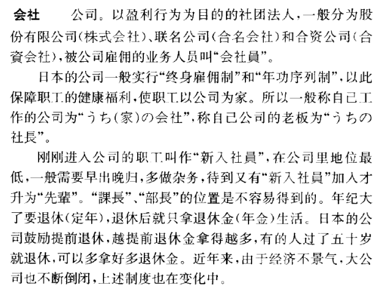
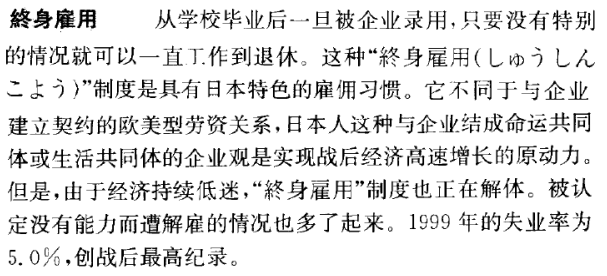
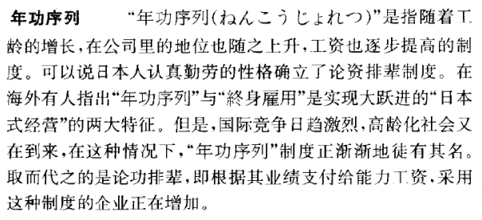

第六课 私の一日
========================

课文
--------

私は毎朝6時半に起きます。そして、ラジオの中国語の勉強を始めます。
中国語の発音は大変難しいです。7時半頃、朝ごはんを食べます。

私の家は郊外にあります。
会社は町の真ん中にあります。家から駅まで10分あまり歩きます。
そして、電車で会社へ行きます。家から会社まで55分かかります。
電車はいつも大変込みます。

会社は9時に始まります。仕事は大抵6時に終わります。
時々駅からタクシーで帰ります。
3分ぐらいです。170円かかります。

私の会社は旅行社です。私は本社にいます。
支店は全国には八か所あります。仕事は大抵面白いです。

私たちはよく出張します。来週は九州へ行きます。
しかし出張はとても疲れます。

日曜日はほとんど会社は休みます。しかし、私の会社はめったに休みません。
社員は交替で休みます。

休みの日は1か月4回ほどです。その日は昼頃に起きます。
あまり外出します。うちでゆっくり小説を読みます。
夜はビールを少し飲みます。そして、ステレオで音楽が聞きます。
時々テレビも見ます。

生词
----------

.. csv-table:: 生词表
   :header: 单词,词类,释义

   いちにち[一日],名,一天，一日
   まいあさ[毎朝],名,每天早上
   おきる[起きる],自上一,起床
   べんきょう[勉強],名-自他サ,学习
   はつおん[発音],名,发音
   ごろ,接尾,（时间上的）左右
   あさごはん[朝ご飯],名,早饭
   たべる[食べる],他上一,吃
   こうがい[郊外],名,
   まんなか[真ん中],名,中心，正中间
   こむ[込む],自五,拥挤
   はじまる[始まる],自五,开始
   おわる[終わる],自五,完毕，结束
   ときどき[時々],副,时常
   かえる[帰る],自五,回来
   かかる[掛かる],自五,花费（时间）
   りょこうしゃ[旅行社],名,
   ほんしゃ[本社],名,总公司
   してん[支店],名,分公司
   しゅっちょう[出張],名-自サ,出差
   つかれる[疲れる],自下一,劳累
   ほとんど,名-副,几乎，大体上
   やすむ[休む],自五,休息
   しかし,副,但是
   こうたい[交替],名-自サ,
   がいしゅつ[外出],名-自サ,
   ゆっくり,副-自サ,慢慢的
   よむ[読む],他五,阅读
   すこし[少し],副,稍微
   のむ[飲む],他五,喝
   ステレオ,名,立体声
   おんがく[音楽],名,
   きく[聞く],他五,听
   みる[見る],他上一,看
   たく[宅],名,住宅
   かいしゃ[会社],名,鹟
   なんじ[何時],代,几点
   そと[外],名,外边
   まだ,副,还
   キロ,名,kilo，千，千米，千克
   きゅうこう[急行],名,快车，大站车
   まんいん[満員],名,满载，满座
   かえり[帰り],名,回来，归途
   たいてい,副,大部分，大约
   のこる[残る],自五,呆着不走
   きゅうりょう[給料],名,工资，薪水
   いかが,副,如何，怎样
   まあまあ,副,（中等程度的）大致，还行
   おととし[一昨年],名,前年
   はいる[入る],自五,进入
   ところで,接,可是
   けっこん[結婚],名-自サ,结婚
   きょねん[去年],名,
   こども[子供],名,孩子
   うまれる[生まれる],自下一,出生

句型
-----------

一、 ::

   （体言）は［时间、方式的体言+格助词］+（自动词连用形）ます・ません。

-  私は毎朝6時に起きます。
-  私は電車で来ます。
-  私は会社へ行きません。
-  田中さんはあまり外出しません。

二、 ::

   （体言）は（体言）を（他动词连用形）ます・ません。

-  私は小説お読みます。
-  王さんはビールを飲みます。
-  私は音楽を聴きません。
-  李さんはテレビを見ません。

三、 ::

   （体言）から（体言）まで /  从……到……

-  家から駅まで10分くらい歩きます。
-  駅から会社まで55分かかります。
-  1時から2時まで休みます。
-  8時から12時までは日本語の時間です。

四、 ::

   めったに…ない / 不常……，很少……

-  私はめったに休んだことはありません。
-  あの先生は滅多に学校を叱りません。
-  あの子は転んでも滅多に泣きません。

语法
---------

一、叙述句
^^^^^^^^^^^^^^^^^^^^

用表示动作的词作谓语说明人、事物的动作。

二、敬体（郑重）助动词「ます」
^^^^^^^^^^^^^^^^^^^^^^^^^^^^^^^^^

「ます」接在一切的动词连用形之后，为动词的敬体表达形式。否定形式为「ません」。

三、动词在形态上的分类
^^^^^^^^^^^^^^^^^^^^^^^^^^^^^^^^^

每个动词可分为词干和词层，词干不变化，词尾变化。词尾变化叫作“活用”。动词按活用规则分类，可分为如下五种：

1. 五段活用动词
	
	这类动词为数最多，它的词尾只有一个假名，且都在「ウ」段上，连用形变成「イ」段的假名。

.. csv-table:: 五段动词活用
   :header: 动词基本形,连用形,连用形+ます,连用形+ません

   歩く,歩き,歩きます,歩きません
   行く,行き,行きます,行きません
   話す,話し,話します,話しません
   立つ,立ち,立ちます,立ちません
   ある,あり,あります,ありません
   帰る,帰り,帰ります,帰りません
   休む,休み,休みます,休みません
   読む,読み,読みます,読みません
   習う,習い,習います,習いません

2. 上一段活用动词
	
	为数不多，词尾有两个假名，最后一个假名都是「る」，且倒数第二个假名在「イ」段（若动词只有2个假名，则第1个假名既是词干又是词尾）。连用形时将「る」去掉。

.. csv-table:: 上一段动词活用
   :header: 动词基本形,连用形,连用形+ます,连用形+ません

   いる,い,います,いません
   見る,見,見	ます,見ません
   起きる,起き	,起きます,起きません

3. 下一段活用动词

	为数较多，下一段动词的词尾有两个假名，最后一个假名都是「る」，且倒数第二个假名在「エ」段（若动词只有2个假名，则第1个假名既是词干又是词尾）。连用形时将「る」去掉。

.. csv-table:: 下一段动词活用
   :header: 动词基本形,连用形,连用形+ます,连用形+ません

   寝る,寝,寝	ます,寝ません
   教える,教え	,教えます,教えません
   食べる,食べ	,食べます,食べません

4. サ行变格活用动词

	包括「する」以及与「する」结合而成的动词，变成连用形时，「する」变为「し」。

.. csv-table:: サ变动词活用
   :header: 动词基本形,连用形,连用形+ます,连用形+ません

   する,し,します,しません
   勉強する,勉強し,勉強します,勉強しません
   散歩する,散歩し,散歩します,散歩しません
   

5. カ行变格活用动词

	カ变动词只有1个「来（く）る」，变化不规则。变连用形时，变为「き」。

.. csv-table:: カ变动词活用
   :header: 动词基本形,连用形+ます,连用形+ません

	来る	,きます,きません

四、自动词与他动词
^^^^^^^^^^^^^^^^^^^^^^^^

动词从它是否需要宾语的角度，可分为自动词和他动词。表现自身动作、作用而不需要宾语的动词叫作自动词，表现对其它事物的动作、作用，需要其它宾语才能表达完整意义的叫作他动词。

- 自动词
	- 木があります。
	- 私は六時に起きます。
	- 私は会社へ行きます。
- 他动词
	- 私は朝ごはんを食べます。 
	- 私は新聞を読みます。
	- 私は音楽を聞きます。

五、格助词「に」「で」「へ」「を」「から」「まで」
^^^^^^^^^^^^^^^^^^^^^^^^^^^^^^^^^^^^^^^^^^^^^^^^^^^^^^^^^^

1. 格助词「を」

接在体言后边，构成宾语

- ご飯を食べます
- 日本語を勉強します。
- ビールを飲みます
- テレビを見ます。

2. 格助词「に」

接在时间词后边，表示动作的具体时间，在句中起“补语”的作用

- 六時に起きます。
- 10時に寝ます。
- あなたは日曜日に何をしますか。

接在数量词后边，构成补语，表示比例、分配的基准。

- 休みの日は一か月に四回ほどです。
- 一週間に三回日本語の勉強をします。
- 一年に一回ペキンへ行きます。

3. 格助词「で」

接在体言后边，表示动作的方法、手段、材料、状态等，在句中作为补语

- 電車で会社に行きます。
- ステレオで音楽を聞きます。
- 社員は交替で休みます。

接在表示地点的体言后边，表示动作进行的场所。相当于汉语的“在……”

- うちでゆっくり小説を読みます。
- 電車の中で新聞を読みます。
- 私たちは教室で勉強をします。
- どこでテレビを見ますか。

4. 格助词「へ」

读作「ｅ」，接在体言后边，表示动作的方向，构成补语。

- 会社へ行きます。
- 九州へ出張します。
- うちへかえります。
- 前へ進みます。

5. 格助词「から」

接在体言后边，表示动作时间或空间的起点，构成补语

- 学校からうちへ帰ります。
- 8時から勉強します。

6. 格助词「まで」

接在体言后边，表示动作时间或空间的终点，构成补语

- 9時までラジオを聞きます。
- 駅まで歩きます。

六、副助词「ぐらい」「ほど」
^^^^^^^^^^^^^^^^^^^^^^^^^^^^^

1. 副助词ぐらい

多接在数词、表示程度的副词、事物指示代词以及この、その、あの、どの之后，表示大概的程度，数量。

- 電車で一時間ぐらいかかります。
- ここからペキンまでどのぐらいありますか
- 少しぐらいあります。

2. 副助词「ほど」

与「ぐらい」用法与含义基本相同，只是「ぐらい」带有“少”的语感，而「ほど」带有“多”的语感。

- 休みの日は一か月に四回ほどです。
- 教室には10人ほどいます
- 一日にどれほどの収入がありますか

「ほど」还可以接在体言、用言以及部分助动词连体形之后表示程度，相当于汉语“像……”，“如同……”，“……得……”

- 昨日は足が痛くなるほど歩きました。
- 曇一つないほど空は晴れています。
- 彼の家は都にもめったにないほどのおお金持ちになりますた。
- 痛くて泣きたいほどです。

七、接尾词「ごろ」「あまり」
^^^^^^^^^^^^^^^^^^^^^^^^^^^^^^^^^^^^^^^^^^^^^^^^^^^^^^^^^^

「ごろ」

接在时间数词后边，表示大概的时间。

- 7時ごろ朝ごはんをたべます
- 夜10時ごろに寝ます
- 朝何時ごろに起きますか

「あまり」

接在数词后，表示“多”

- 家から駅まで10分あまり歩きます
- 学生が３０人あまりいます。

八、时间数量词的说法
^^^^^^^^^^^^^^^^^^^^^^^^^^^^^^^^^^^^^^^^^^^^^^^^^^^^^^^^^^

1. 时间

   一至十点：いちじ、にじ、さんじ、よじ、ごじ、ろくじ、しちじ、はちじ、くじ、じゅうじ

   几时：なんじ

   一至十分：いっぷん、にふん、さんぷん、よんぷん、ごふん、ろっぷん、しちふん、はっぶん、きゅうふん、じっぷん

   何時何分：なんじなんぶん

2. 日历用日月的说法

   一至五日： ついたち、ふつか、みっか、よっか、いつか

   六至十日：むいか、なのか、ようか、ここのか、とおか

   二十日：はつか

   一至六月：いちがつ、にがつ、さんがつ、しがつ、ごがつ、ろくがつ

   七至十二月：しちがつ、はちがつ、くがつ、じゅうがつ、じゅううちがつ、じゅうにがつ

   何日，何月：なんにち、なんかつ

3. 年月日

   2000年7月24日：にせんねん　しちがつ　にじゅかよっか

   何年何月何日：なんねん　なんがつ　なんにち

4. 单位时间以及时间段

   1. 时分秒

      一至四小时：いちじかん、にじかん、さんじかん、よじかん
      
      九小时、十小时、几小时：くじかん、じゅうじかん、なんじかん

      一至四分：いちふん、にふん、さんふん、よふん

      几分：なんふん
      
      秒：びょう

   2. 日

      いちにちかん、ふつかかん、みっかかん、よっかかん、いつかかん、
      
      むいかかん、なのかかん、ようかかん、ここのかん、とおかかん

      なんにちかん

   3. 月

      一ヶ月 ~ 六ヶ月：いっかげつ、にかげつ、さんかげつ、よんかげつ、ごかげつ、ろっかげつ

      七ヶ月 ~ 十二ヶ月： しちかげつ、はちかげつ、くかげつ、じゅうかげつ、じゅういちかげつ、じゅうにかげつ

   4. 年

      一年~四年：いちねん、にねん、さんねん、よねん、

   5. 星期

      一週間　~　四週間：いっしゅうかん、にしゅうかん、さんしゅうかん、よんしゅうかん

课后练习
-------------

.. toctree::
   :maxdepth: 1

   chap14-q
   chap14-qa

补充词汇
-------------

.. csv-table:: 生词表
   :header: 单词,词类,释义

   かく[書く],他五,写
   おちゃ[お茶],名,
   コーヒー,名,coffee
   ミルク,名,milk
   テープ,名,tape
   えいが[映画],名,电影
   じ[字],名,
   レストラン,名,餐厅
   きっさてん[喫茶店],名,
   パン屋,名,面包店
   ともだち[友達],名,朋友们
   ちかてつ[地下鉄],名,
   きしゃ[汽車],名,火车
   ねる[寝る],自下一,
   きんようび[金曜日],名,周五
   しごと[仕事],名,工作
   らいしゅう[来週],名,下周
   ばん[晩],名,
   おおさか[大阪],名,
   いっしゅうかん[一週間],名,
   いっかげつ[一ヶ月],名,
   いちねん[一年],名,
   かい[回],接尾,……次 ，……回
   ふるさと[故郷],名,
   にちようび[日曜日],名,周日
   かいもの[買い物],名-自サ,购物
   たんじょうび[誕生日],名,生日
   じゅうにかげつ[十二ヶ月],名,
   ジョギング,名,慢跑
   たまご[卵],名,鸡蛋
   おしえる[教える],他下一,
   じゅぎょう[授業],名-自サ,上课
   ばんごはん[晩御飯],名,
   せんたくき[洗濯機],名,
   せんたく[洗濯],名,
   そうじ[掃除],名,
   ひるごはん[昼ごはん],名,午饭
   ごご[午後],名,下午
   しょっき[食器],名,餐具
   ひる[昼],名,中午
   ずっと,副,（从……）一直，始终
   めった,名,（以「……に」的形式下接否定）不常，不多
   たのしい[楽しい],形,快乐

语言文化之窗
------------------

会社
^^^^^^^^^^^^

终身雇佣
^^^^^^^^^^^^^^^^^^^^^^^^

年功序列
^^^^^^^^^^^^^^^^^^^^^^^^

