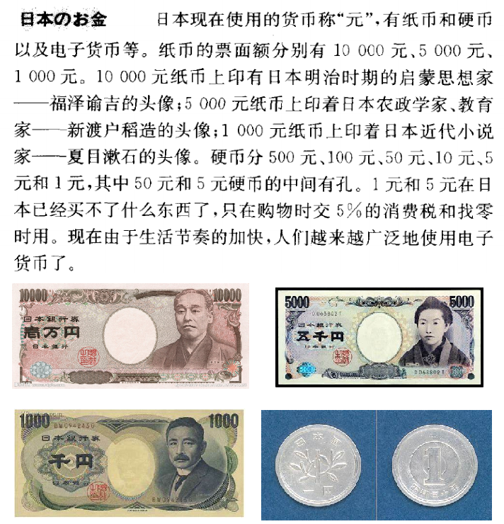

第九课 朝の散歩
==========================================

课文
-------------

目が覚めるとすぐ飛び起きて庭にてしました。

空は青く晴れて曇り一つありません。朝日が庭いっぱいにさしています。夕べの雨に濡れた木の葉がキラキラ光っています。本当に気持ちのいい朝です。

私の胸いっぱい朝の綺麗な空気を吸いながら、柔らかい土を踏んで、庭を歩きました。

向こうに見える森も林も家も、朝日を受けて　ています。どうからかラジオ体操の音楽が聞こえてきます。

小鳥も嬉しそうに鳴きながら、枝から枝に飛び移っています。池に水がいっぱいになっていて、金魚も気持ちよさそうに泳いでいます。

私はしばらく庭を散歩してから、部屋に戻って、朝ごはんまで新聞を読みました。

会话
-------------

A:あなたは何時起きましたか？

B:5時半に起きました。

A:いい天気でしょうか？

B:空は青く晴れて曇り一つ余りませんでした。

A:あなたは起きてから何しましたか？すぐ庭に置きます。

B:すかすかしかったでしょう？朝が庭いっぱいにさして、郵便の雨に濡れた木の葉がキラキラ光っていました。

A:あなたの家の庭は広いですか？

B:広くはありませんが、バースデーがあってキーもう少しあります。

A:池もありますか？

B:はい、小さい池があって金魚やりんが元気よく泳ぎ回っています。

A:小鳥も来ますか？

B:朝はたくさん来て楽しそうに。

生词
---------------

.. csv-table:: 生词表
   :header: 单词,词类,释义

    さめる[覚める],自下一,醒来
    とびおきる[飛び起きる],自上一,起床
    そら[空],名,天空
    くも[雲],名,云彩
    あさひ[朝日],名,朝阳
    いっぱい[一杯],副,满，全部
    さす[差す],自五,照射
    ゆうべ[夕べ],名,昨晚
    ぬれる[濡れる],自下一,湿润，沾湿
    きらきら,副,闪亮
    ひかる[光る],自五,发光
    ほんとうに[本当に],副,真，特别，完全
    きもち[気持ち],名,心情
    むね[胸],名,心中
    すう[吸う],他五,
    やわらかい[柔らかい],形,柔软的
    つち[土],名,
    ふむ[踏む],他五,
    むこう[向こう],名,对面
    みえる[見える],自下一,看到
    もり[森],名,
    はゃし[林],名,
    かがやく[輝く],自五,放光辉
    どこからか,连语,不知从哪里
    ラジオたいそう[ラジオ体操],名,
    きこえる[聞こえる],自下一,听到
    なく[鳴く],自五,鸣叫
    えだ[枝],名,
    とびうつる[飛び移る],自五,
    しばらく,副,暂时、暂且、一会儿
    もどる[戻る],自五,返回，回来，恢复
    すがすがしい[清々しい],形,
    しばふ[芝生],名,草坪
    ひごい[緋鯉],名,
    げんきよく[元気よく],副,精神饱满地
    およぎまわる[泳ぎ回る],自五,游来游去
    さえずる[囀る],自五,（鸟）叫
    にわつち[庭土],名,

句型
------------

一、 ::

    动词连用形（五段动词音便形）ている。

1. 表示动作的进行态

	1. 表示人、动物的动作或事物的作用正在进行

- 李さんは新聞を読んでいます。
- 周さんはテレビを見ています。
- 鳥がえだからえだに飛び移っています。
- 金魚が池て泳いでいます。
- いま雨が降っています。
- 風が吹いています。
- 朝日が庭にさしています。
- 木の葉が光っています。
- 赤い星がかがやいています。

	2. 表示经常、反复或习惯性的动作、行为

- わたしは毎日日本語を勉強しています。
- 父は会社に勤めています。
- 母は小学校の校長をしています。

2. 表示动作的存续态

	1. 表示事物动作、作用的结果仍在持续状态中（动词一般是自动词）

- 花が咲いています。
- 空は晴れています。
- 池の水がいっぱいになっています。

	2. 表示人的某些动作的结果仍在持续状态（专指某些瞬间动词）

- 田中さんは眼鏡をかけています。
- 木和さんはきれいな上着を着ています。
- 佐藤さんは黒い帽子をかぶっています。

二、 ::

	(动词连用形)ました・ませんでした。／（表示过去的动作行为）

- 朝わたしは教室にいました。
- 空は雲一つありませんてした。
- 夕べ私は父に手紙を書きました。
- あなたは昨日何をしましたか。
- 私は昨日町へ行きませんでした。

三、 ::

	（体言、形容动词词干）でした・ではありませんでした。

- 
 - 昨日はいい天気でしたか。
 - いいえ、昨日はいい天気ではありませんでした。
- 高校生の時、私はバスケットボールが好きでした。けれども、あまり上手ではありませんでした。

四、 ::

	（动词终止形）とすぐ……/ 之后就

- 目が覚めるとすぐ飛び起きて、庭に出ました。
- 朝起きるとすぐラジオ体操をします。
- 王さんは晩ご飯を食べるとすぐ図書館へ行きました。

五、 ::

	动词连用形（五段动词音便）てから……/……之后……

- 復習してから宿題をやります。
- しばらく庭を散歩してから部屋に戻ります。
- ご飯を食べてから電話をかけます。
- 少し休んでから本を読みます。

语法
---------------

一、过去助动词「た」
^^^^^^^^^^^^^^^^^^^^^^^^^^

接在用言以及助动词的连用形（五段动词音便）之后，表示过去或完成。终止形和连体形都是 「た」。

1.表示过去

- 昨日は大変寒かったです。
- あなたは今朝何時に起きましたか。
- 去年は何の年でしたか。

2.表示完成

- や、また雨が降り出した。
- ただいま帰りました。
- 習った文型を復習する。

二、接续助词「と」
^^^^^^^^^^^^^^^^^^^^^^^^^^
接在用言用助动词的终止形之后，构成条件句。

1. 表示某种条件必然产生某种结果

- 春になると暖かくなります。
- 積もった雪を取り除かないと、家がつぶれたりします。

2. 表示前一个动作之后立即进行另一动作（见句型四）

三、格助词「に」
^^^^^^^^^^^^^^^^^^^^^^^^^^

表示动作的到达、归着点

- 私は庭に出ました。
- 小鳥が枝から枝に飛び移っています。
- 私は部屋に戻りました。
- 日は東から出て、西に入ります。
- 黒板に字を書きます。

四、格助词「を」
^^^^^^^^^^^^^^^^^^^^^^^^^^

带有移动性的自动词所表示的动作经过、进行或离开的场所，构成补语。

- 私は庭を散歩します。
- 鳥は空を飛んでいます。
- 私たちは橋を渡りました。
- 毎朝7時に家を出て、学校へ行きます。

五、样态助动词「そうだ」
^^^^^^^^^^^^^^^^^^^^^^^^^^

接在动词连用形及形容词、形容动词的词干下。表示根据自己的推测，预料是这种情况，主要用于对眼前事物的具体样子、情况、趋势的推测上。相当于汉语的“好像……似的”，“看来要……”。「そうだ」属于形容动词型活用。

- 雨が降りそうだ。
- 小鳥が嬉しそうに鳴っています。
- あれはおもしろそうなことです。

六、补助动词「くる」
^^^^^^^^^^^^^^^^^^^^^^^^^^

有些动词在句中失去它原来的意思和独立性，和助动词一样起补助的作用，这样的动词即“补助动词”，如「……ている」中的「いる」。补助动词「くる」与助词「て」连用，组成「…てくる」的形式表示动作由远及近的移动或由过去到现在的趋势，相当于“……起来”，“……来”。

- どこからかラジオ体操の音楽を聞こえできます。
- 人民の生活はゆたかになってきました。
- タクシーが遠くから走ってきました。

课后练习
-------------

.. toctree::
   :maxdepth: 1

   chap17-q

补充词汇
-------------------------

.. csv-table:: 生词表
   :header: 单词,词类,释义

    あう[会う],自五,碰见
    わらう[笑う],自五,
    はなす[話す],他五,
    たつ[立つ],自五,
    しぬ[死ぬ],自五,
    すわる[座る],自五,
    とぶ[飛ぶ],自五,
    かいわ[会話],名・自サ,
    れんしゅう[練習],名・自サ,
    みせ[店],名,
    うる[売る],他五,
    みなさん,代,各位、大家
    あつまる[集まる],自五,
    あく[開く],自五,
    こうてい[校庭],名,
    ふろ[風呂],名,
    お風呂に入る,连语,洗澡
    きのう[昨日],名,
    おととい[一昨日],名,
    せんしゅう[先週],名,
    せんじつ[先日],名,
    むかし[昔],名,
    わかい[若い],形,年轻
    なりたくうこう[成田空港],名,
    つく[着く],自五,到达
    しゅくだい[宿題],名,作为
    やりおわる[遣り終わる],名,做完
    ふくしゅう[復習],名・他サ,
    みち[道],名,
    はしる[走る],自五,奔跑，（车船）高速行驶
    わたる[渡る],自五,
    おうだんほどう[横断歩道],名,
    やまもと[山本],名,（姓氏）
    じむしつ[事務室],名,
    おとうさん[お父さん],名,
    なわとび[縄跳び],名,跳绳
    ぶらんこ,名,秋千
    ぶらんこにのる[ぶらんこに乗る],名,荡秋千
    ならう[習う],他五,
    だいがく[大学],名,
    いがく[医学],名,
    けんきゅう[研究],名,
    ちゅうがっこう[中学校],名,
    はたらく[働く],自五,工作，劳动
    かじ[家事],名,家务
    てつだい[手伝い],名,帮忙，帮助
    しゃちょう[社長],名,
    おにいさん[お兄さん],名,
    てんちょう[店長],名,
    おねえさん[お姉さん],名,
    かんごふ[看護婦],名,
    こうちょう[校長],名,
    いしゃ[医者],名,
    てんいん[店員],名,
    おかあさん[お母さん],名,
    おじいさん[お爺さん],名,
    おばあさん[お婆さん],名,
    まご[孫],名,
    せわ[世話],名・他サ,照料，照看
    いもうとさん[妹さん],名,
    おまわりさん[お巡りさん],名,
    みちをきく[道を聞く],连语,问路
    えん[円],名,
    だんだん,副,渐渐
    はれる[晴れる],名,
    から,格助,从……，由……
    ハイキング,名,hiking
    こみち[小道],名,
    もくてきち[目的地],名,
    まわり[回り],名,周围，四周
    おがわ[小川],名,
    したく[支度],名,预备，准备
    かおく[家屋],名,
    たおれる[倒れる],自下一,
    もんだい[問題],名,
    しけんもんだい[試験問題],名,
    しんぱい[心配],名・自他サ,担心害怕
    おこる[怒る],自五,
    めがね[眼鏡],名,
    しゅう[周],名,（姓氏）
    うわぎ[上着],名,外衣，上衣
    あぶない[危ない],形,
    いっしょうけんめい[一生懸命],副・形动,
    なく[泣く],自五,哭

语言文化之窗
------------------------

日本的货币
^^^^^^^^^^^^^^^^^^^^^^^^

